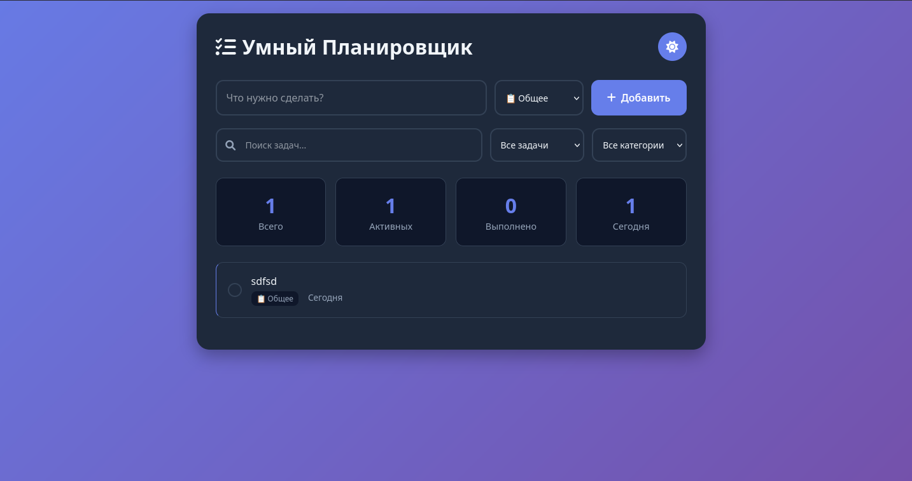

# 🚀 Умный To-Do List

<div align="center">


**Современное веб-приложение для управления задачами с расширенными функциями**

</div>

### 📱 Скриншоты

| Светлая тема | Темная тема | 
|--------------|-------------|
|  |  |

</div>

## ✨ Особенности

### 🎯 Основные функции
- ✅ **Добавление задач** с категориями (работа, личное, учеба, общее)
- 🔍 **Умный поиск** по задачам в реальном времени  
- 🏷️ **Фильтрация** по статусу и категориям
- 🌙 **Темная/светлая тема** с сохранением выбора
- 💾 **Локальное сохранение** данных в браузере

### 🚀 Дополнительные возможности
- 📊 **Статистика задач** (всего, активные, выполненные, за сегодня)
- ✏️ **Редактирование задач** прямо в списке
- 📅 **Даты создания** с умным форматированием
- 📱 **Адаптивный дизайн** для мобильных устройств
- 🎨 **Плавные анимации** и современный UI

## 🚀 Быстрый старт

### 1. Клонирование репозитория
```bash
git clone https://github.com/ivesomeproblems/smart-todo-app.git
cd smart-todo-app